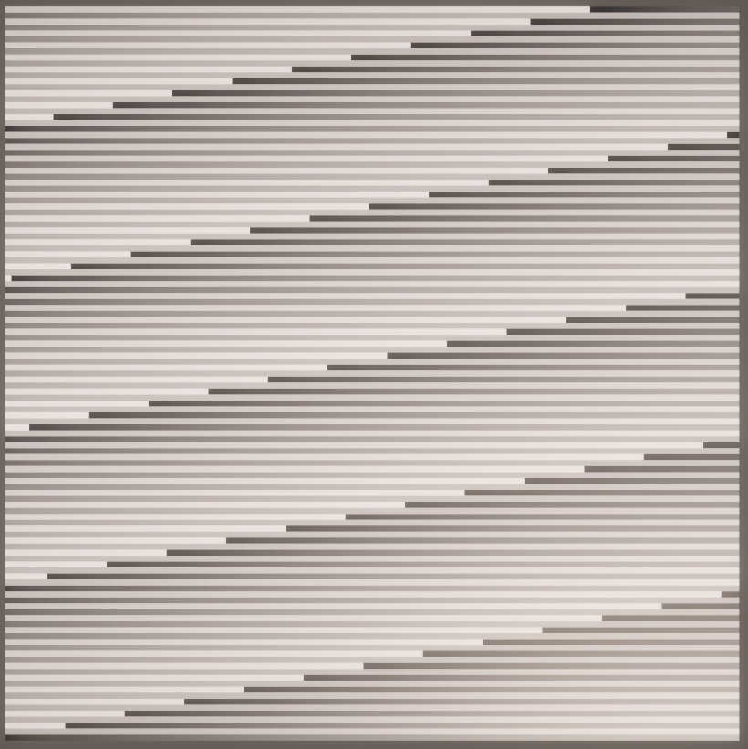
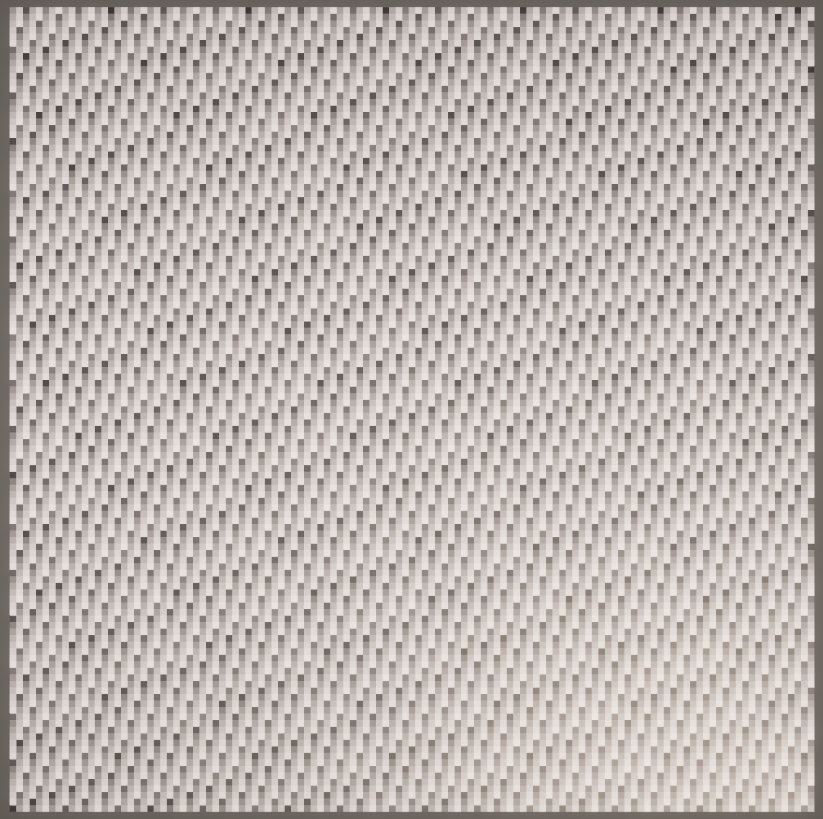
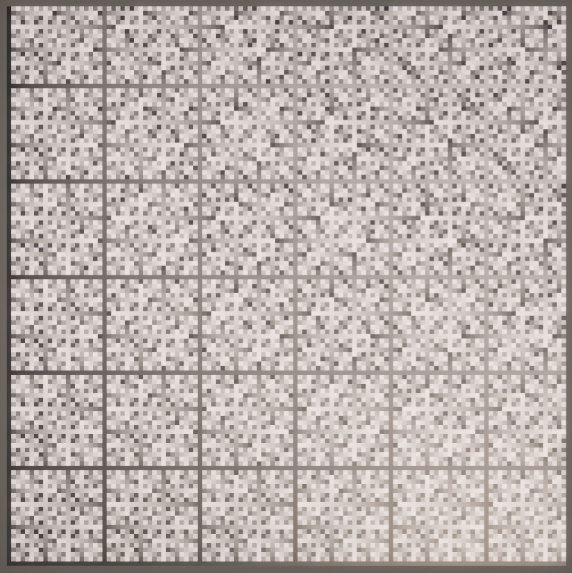
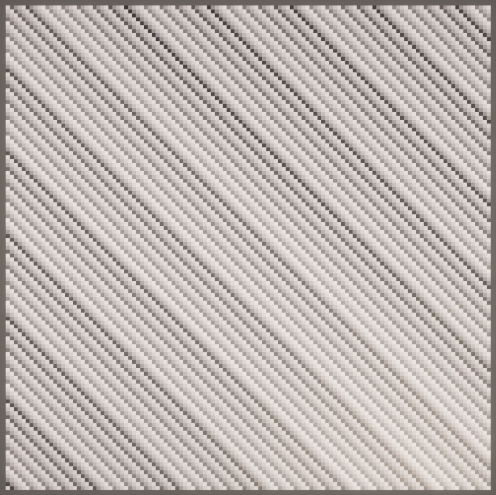
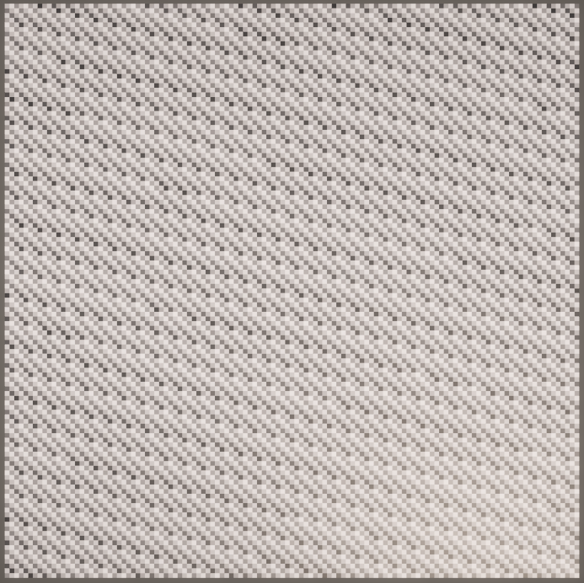
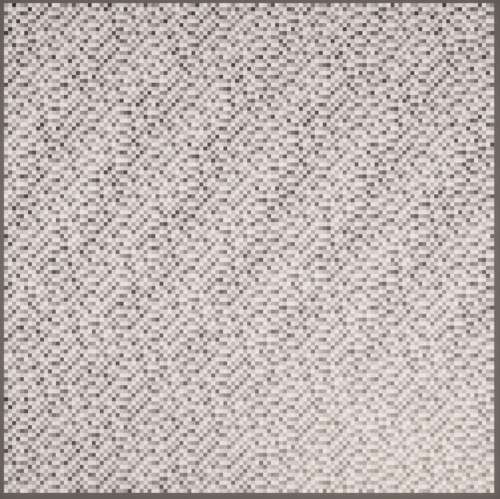
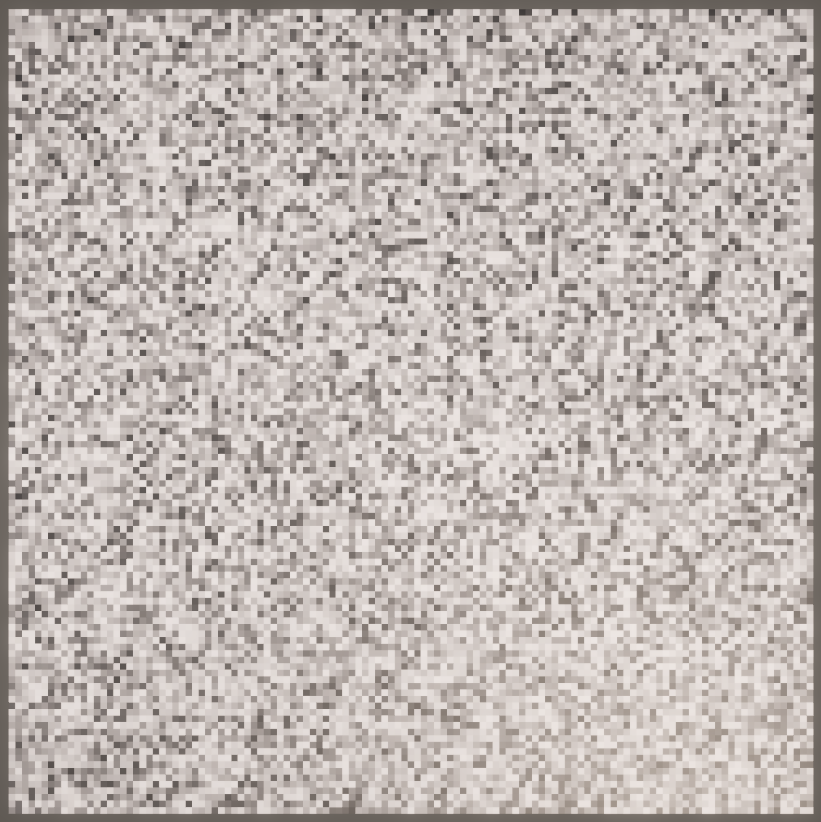

# Pseudorandom Noise

This project is a follow-along of
[Jasper Flick's Catlike Coding](https://catlikecoding.com/unity/tutorials/)
tutorial on
[pseudorandom noise](https://catlikecoding.com/unity/tutorials/pseudorandom-noise).

Notably, this project was created via URP's default project, which (seemingly)
adds some form of global illumination and bloom. I think it looks fairly good,
so I'll keep it.

## Part 1 - [Hashing](https://catlikecoding.com/unity/tutorials/pseudorandom-noise/hashing/)

This part entails creating a hashing function to create pseudorandom noise.
We'll visualize it on a grid of procedurally generated cubes. I'll draw these
with an image of 123 by 123 pixels.

| Grid                                      | Notes                                                                                                   |
| ----------------------------------------- | ------------------------------------------------------------------------------------------------------- |
|               | Our base grid.                                                                                          |
|          | Making our grid repeat every 256 values gives some interesting (non-random) effects.                    |
|               | Adding Weyl sequencing makes a repeating pattern where the direction is based on the resolution.        |
|             | Basing the Weyl sequence on the UV coordinates of the points breaks the pattern up, but adds this grid. |
|          | XXHash32 is a fast hashing function using 5 prime numbers. This is the output with only 1/5.            |
|     | After 'eating' data, XXHash32 will 'rotate' bit values to further permute.                              |
|        | Here is the hashed output after involving primes C, D, and E (3/5 primes).                              |
|  | 'Avalanching' is the final step - XORing and shifting a lot of random bits repetitively.                |
|    | This hashing function demonstrates scale invariance as well.                                            |

# License TL;DR

This project is distributed under the MIT license. This is a paraphrasing of a
[short summary](https://tldrlegal.com/license/mit-license).

This license is a short, permissive software license. Basically, you can do
whatever you want with this software, as long as you include the original
copyright and license notice in any copy of this software/source.

## What you CAN do:

-   You may commercially use this project in any way, and profit off it or the
    code included in any way;
-   You may modify or make changes to this project in any way;
-   You may distribute this project, the compiled code, or its source in any
    way;
-   You may incorporate this work into something that has a more restrictive
    license in any way;
-   And you may use the work for private use.

## What you CANNOT do:

-   You may not hold me (the author) liable for anything that happens to this
    code as well as anything that this code accomplishes. The work is provided
    as-is.

## What you MUST do:

-   You must include the copyright notice in all copies or substantial uses of
    the work;
-   You must include the license notice in all copies or substantial uses of the
    work.

If you're feeling generous, give credit to me somewhere in your projects.
